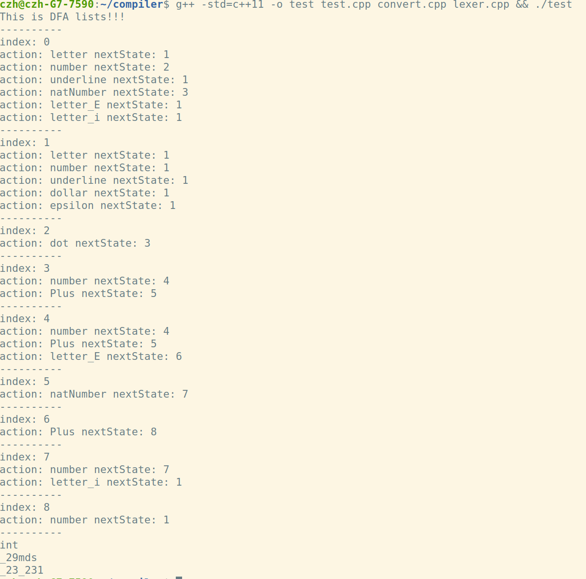
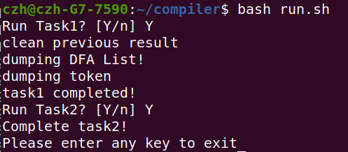
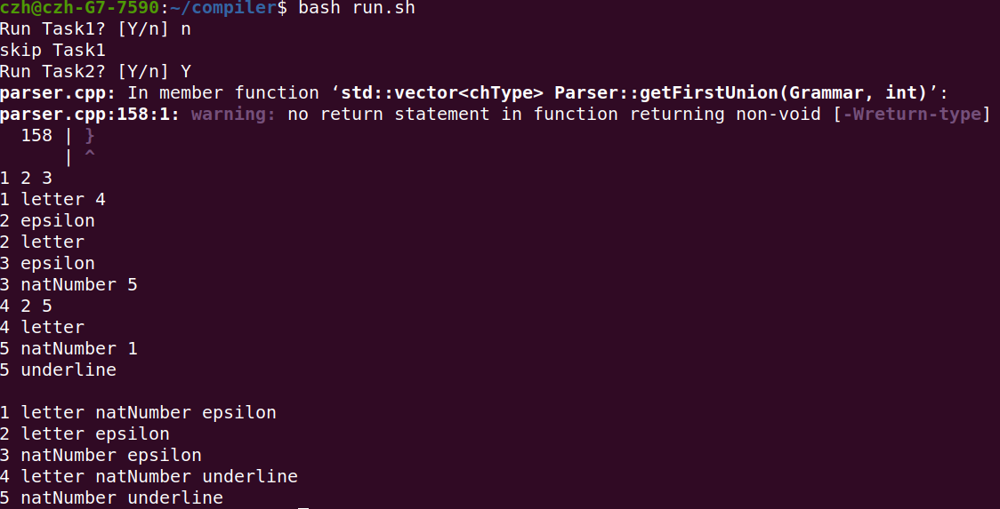
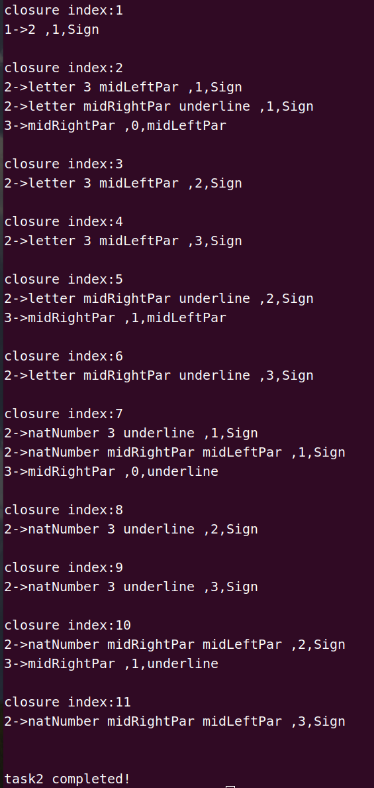
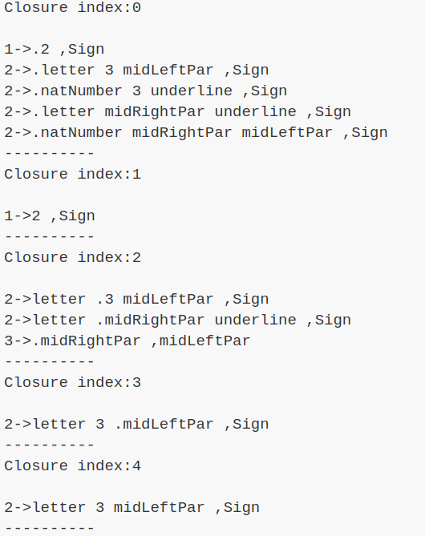
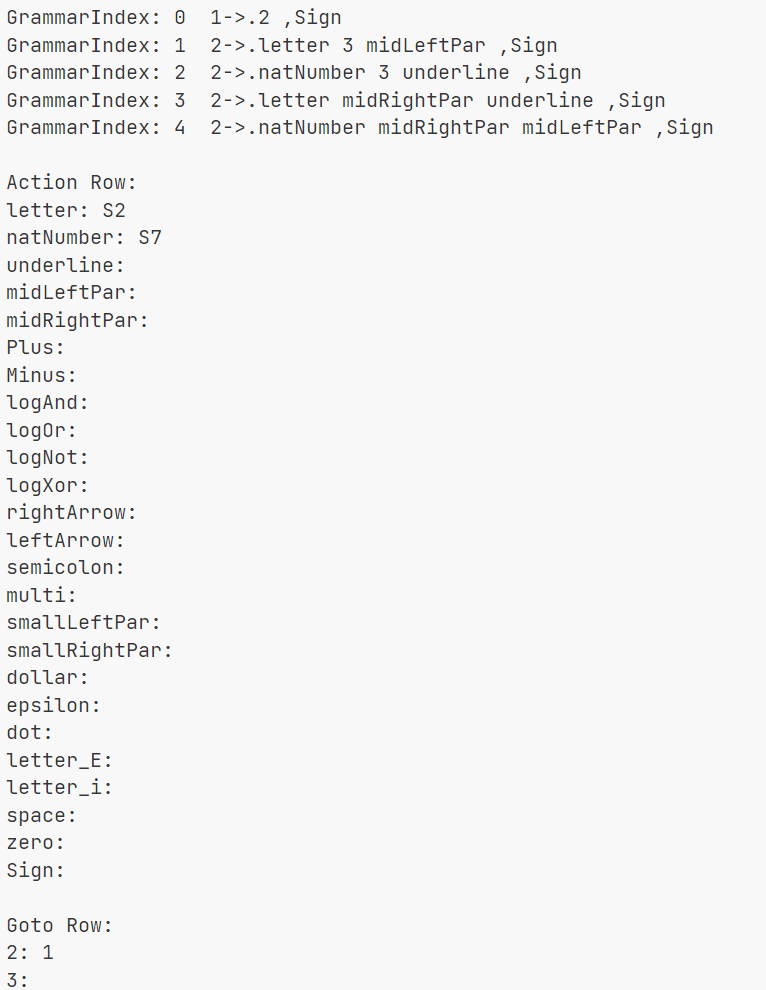

# compiler

**Notice：该项目应当运行于Linux系统（建议运行于Ubuntu系统）且支持至少C++11**

### 2022.2.26

---

#### 15:53

完成三型文法至DFA的转换

---

#### 20:23

代码存在部分问题，完成已知的bug修复 

**由于编译问题，暂时将所有文件放在`new.cpp`和`new.h`中** 

目前进展：可以将合法的字符组成(以下划线和字母为首)正确分割

---

#### 21:18

修复编译问题，重新组织文件结构

.  
├── convert.cpp  
├── convert.h  
├── header.h  
├── lexer.cpp  
├── lexer.h  
├── README.md  
├── simulation  
│   ├── grammar.txt  
│   └── test.txt  
├── test  
└── test.cpp  

1 directory, 10 files

### 2022.2.27

---

#### 13:53

完成DFA最小化，并且可以输出具体的DFA列表，输出结果如图

---

#### 14:02

**新增加部分词法规则**  

1. 科学计数法
2. 复数常量

### 2022.3.6

---

#### 20:38

1. 修复部分bug
2. 需要添加运算epsilon-closure的功能，并修改数字的正则文法

### 2022.3.20

---

#### 17:48

1. 完成添加epsilon-closure的功能
2. 修改正则文法，以达到任务一目标
3. 增加识别类型函数
4. 增加识别运算符功能
5. 添加运行脚本`run.sh`

**运行截图：**

---

#### 19:37

1. 上个版本存在无法识别如*1+3.4i*一类的数字，已修复
2. 修复第一个问题时出现段错误，经过gdb debug后发现，`addNode()`函数中使用了`vector::insert()`方法，容易造成越界导致段错误，已更改为`vector::push_back()`
3. 修改测试数据

**运行结果：**

### 2022.3.27

---

#### 13:42

1. 调整文件结构
2. 结果输出在终端改为dump到文件夹中
3. 调整`run.sh`文件，增加运行多个task功能

**运行结果：**

---

#### 15:21

1. 增加语法分析器读取二型文法功能

**文件结构：**

.   
├── image   
│   ├── 2022.2.27.png   
│   ├── run_3.27.png    
│   ├── task one2.png   
│   └── task one.png    
├── lexical     
│   ├── convert.cpp     
│   ├── convert.h   
│   ├── header.h    
│   ├── lexer.cpp   
│   ├── lexer.h     
│   ├── lexical     
│   ├── lexical.cpp     
│   └── token.txt   
├── parser  
│   ├── header.h    
│   ├── parser.cpp  
│   └── parser.h    
├── README.md   
├── res     
├── run.sh  
└── simulation  
    ├── grammar.txt     
    └── test.txt    

5 directories, 19 files 

### 2022.4.10

---

#### 22:00

1. 修改文件路径和run.sh

---

#### 22:41

1. 修改chType类内成员及初始化函数
2. 修改语法分析器读取二型文法功能，2022.3.27 15:21版本无法读取二型文法

---

#### 23:25

1. 增加新类`NonTerminal`
2. 添加函数声明`NonTerminal::getFirstUnion`、`Parser::getFirstUnion`

### 2022.4.11

---

#### 13:31

1. 类`chType`中增加类成员`nonTerminal`
2. 更新函数`getFirstUnion()`
3. 新增函数`breakFirstUnion()`，用于判断是否退出计算FIRST集合

### 2022.4.12

---

#### 23:29

1. 完成计算FIRST集功能
2. 经过测试，暂未发现问题

**运行结果：**

### 2022.4.13

---

#### 15:10

1. 增加类`Closure`
2. 增加函数`Closure::initial()`
3. 调整FIRST集输出格式

### 2022.4.16

---

#### 18:22

1. 更新`Closure::initial()`

### 2022.4.24

---

#### 12:31

1. 完成自动机的闭包运算

**运行结果**：

---

#### 20:09

1. 增加dump closure功能

**运行结果**：

---

#### 23:34

1. 更新dump closure，输出更多数据
2. 完成action表与goto表
3. closure类中增加下一个状态的相关信息

**WARNING：** 如果未执行过任务一，暂时需要先在目录中创建文件夹`/res`

**运行结果**：

### 2022.4.25

---

#### 10:13

1. 增加python文件`dumpTable.py`，用于生成`action&goto table.xls`

---

#### 15:54

1. 更新自动化脚本，修复删除结果失败时无法运行的bug
2. 修复未创建`res`文件夹时无法dump结果的bug
3. 调整dump结果文件结构

### 2022.4.27

---

#### 00:50

1. 修复部分潜在的bug
2. 完成语法分析基本功能
3. 增加更多的dump结果
4. 调整文件结构
